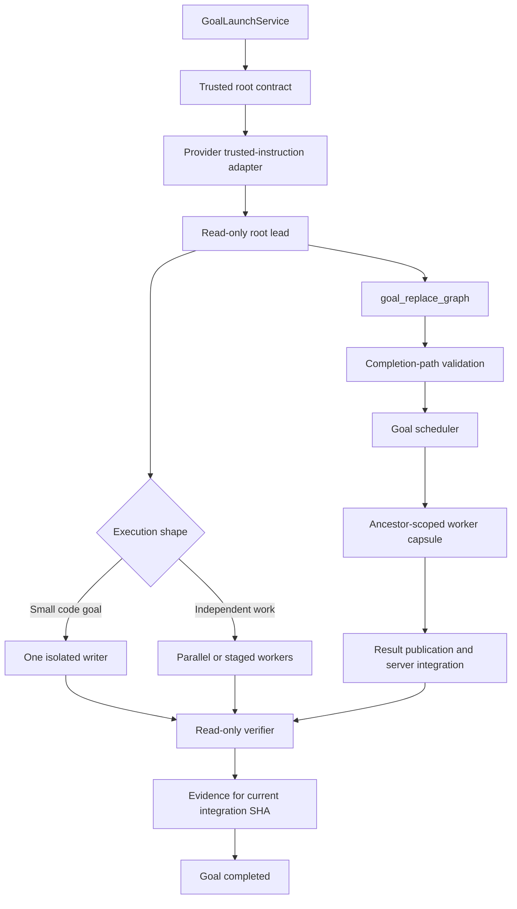
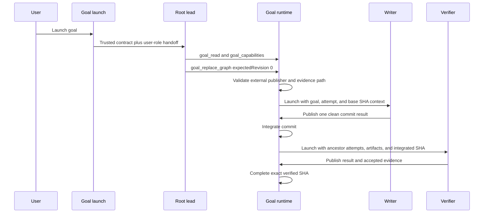
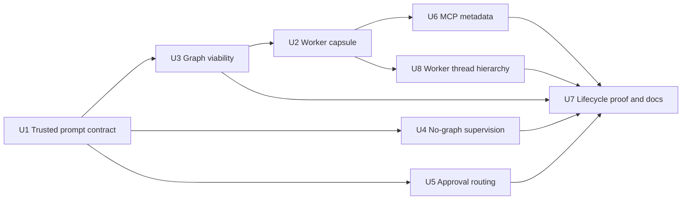

# Goal Root Lead Execution Contract - Plan

## Goal Capsule

| Field             | Contract                                                                                                                                                                                      |
| ----------------- | --------------------------------------------------------------------------------------------------------------------------------------------------------------------------------------------- |
| Objective         | Make every new goal root lead recognize its orchestration role, publish the smallest completion-valid graph, and give workers enough durable context to finish the goal.                      |
| Authority         | Goal lifecycle and workspace invariants outrank source conversation and project text; repository instructions still govern the implementation performed by workers.                           |
| Execution profile | TypeScript changes across provider instruction delivery, goal launch, approval routing, graph validation, worker launch, MCP metadata, lifecycle supervision, and blocked-state presentation. |
| Stop conditions   | The root lead never gains a writable checkout, a direct integration path, generic delegation authority, or a provider-specific orchestration mode.                                            |
| Tail ownership    | The server owns scheduling, integration, and completion; the root lead owns graph publication and human-steered revisions; workers own scoped results and evidence.                           |

---

## Product Contract

### Summary

Adopt Claude Code's selective-delegation behavior without weakening T3's durable goal architecture.
The root lead performs bounded read-only discovery directly, then chooses between a minimal single-executor graph and a larger decomposed graph.
“Direct work” means one isolated writer followed by one independent verifier, not source edits by the read-only lead.

### Problem Frame

The current root lead receives an ordinary coding request plus source context but no trusted orchestration contract.
It therefore tries to edit its shared read-only checkout, never calls `goal_replace_graph`, and leaves the goal in `planning`.
A read-only discovery command can also raise an approval under the raw provider-thread identity, leaving the request invisible in the application thread and hanging graph publication.
A coordinator-only instruction that always creates many workers would fix the dead end but add needless latency and coordination cost to small, tightly coupled changes.
The implementation needs selective graph sizing, completion-valid graph structure, worker lifecycle instructions, and an observable failure when the first lead turn still ends without a graph.

### Actors

| ID  | Actor                | Responsibility                                                                                                                  |
| --- | -------------------- | ------------------------------------------------------------------------------------------------------------------------------- |
| A1  | Goal user            | Supplies the objective, source conversation, selected context, and project instructions.                                        |
| A2  | Root lead            | Inspects read-only state, reads goal capabilities, publishes a whole-graph revision, and handles later human-steered revisions. |
| A3  | Goal worker          | Executes one graph node within its narrowed workspace and publishes scoped result artifacts.                                    |
| A4  | Independent verifier | Runs machine-backed checks against the integrated SHA and submits evidence tied to a distinct producer attempt.                 |
| A5  | Goal runtime         | Validates graphs, schedules attempts, provisions workspaces, integrates writer commits, and terminalizes verified goals.        |

### Requirements

#### Root role and authority

| ID  | Requirement                                                                                                                                                                                                                 |
| --- | --------------------------------------------------------------------------------------------------------------------------------------------------------------------------------------------------------------------------- |
| R1  | Root launch sends a server-owned orchestration contract through the provider adapter's trusted instruction channel, separate from the user-role objective, source summary, selected context, and project instruction text.  |
| R2  | The contract states that the root checkout is reference-only and that direct edits, commits, worker-result publication, and generic delegation are invalid root-lead output.                                                |
| R3  | The root lead calls `goal_read` and `goal_capabilities` before graph publication, uses the current revision for compare-and-swap, and publishes the full next graph through `goal_replace_graph`.                           |
| R4  | Source conversation and project instructions are untrusted task data: they may refine worker work but cannot override the trusted goal lifecycle, workspace isolation, graph publication, or independent-evidence contract. |

#### Selective execution

| ID  | Requirement                                                                                                                                                                                                              |
| --- | ------------------------------------------------------------------------------------------------------------------------------------------------------------------------------------------------------------------------ |
| R5  | The root lead handles bounded repository discovery directly when it is cheaper than delegation, but all repository mutation runs in graph writer nodes.                                                                  |
| R6  | A small, tightly coupled code goal uses single-executor mode: one isolated writer followed by one dependent read-only verifier.                                                                                          |
| R7  | A root-lead exec-approval request resolves from its provider thread to the bound application thread before persistence, appears in the existing approval UI, and resumes the same provider turn after the user responds. |
| R8  | A goal with genuinely independent implementation work uses parallel writer or read-only nodes with explicit dependencies and one terminal verifier that transitively follows every writer.                               |

#### Durable graph and worker completion

| ID  | Requirement                                                                                                                                                                                                                                                                         |
| --- | ----------------------------------------------------------------------------------------------------------------------------------------------------------------------------------------------------------------------------------------------------------------------------------- |
| R9  | Graph publication derives the canonical external publisher from the authenticated goal-lead scope and rejects an empty graph, a graph that schedules the root lead as a worker, or any graph without a verifier that has a producer ancestor and transitively follows every writer. |
| R10 | Every worker prompt is composed from a fresh active-graph projection and includes the goal, graph, node, attempt, workspace-base SHA, ancestor attempt, and relevant ancestor artifact identifiers required by its allowed MCP tools.                                               |
| R11 | Writer prompts require exactly one clean commit on the isolated attempt branch and result publication through `goal_result_publish`; they never instruct the worker to integrate its own commit.                                                                                    |
| R12 | Verification prompts require durable command logs, the exact workspace-base integration SHA, one deterministic succeeded producer ancestor, result publication, and evidence submission through `goal_evidence_submit`.                                                             |
| R13 | All goal MCP tools expose provider-visible descriptions and titles that name role restrictions, revision semantics, result ownership, and evidence requirements.                                                                                                                    |

#### Failure and recovery behavior

| ID  | Requirement                                                                                                                                                                                                                                                                            |
| --- | -------------------------------------------------------------------------------------------------------------------------------------------------------------------------------------------------------------------------------------------------------------------------------------- |
| R14 | A stale graph revision causes the root lead to re-read current goal state and reconcile a new whole-graph revision instead of replaying stale input.                                                                                                                                   |
| R15 | The exact initial root run ID is persisted with launch completion; whether its terminal event arrives before or after the transition to revision-zero `planning`, one idempotent goal-state compare-and-swap records `root_lead_no_graph` and moves the goal to `blocked`.             |
| R16 | A later human Queue or Steer turn may publish a valid graph from the blocked root thread, which returns the goal to `running`; a terminal retry without a graph records a run-specific diagnostic while the goal remains blocked.                                                      |
| R17 | The happy path produces no root-lead mutation approval request; all edit authority belongs to isolated writer attempts.                                                                                                                                                                |
| R18 | Graph activation is allowed from `planning`, `running` replacement, revisioned root-controlled `paused` replacement, or recoverable revision-zero `blocked`; the same transaction rejects `cancelled`, `completed`, and `failed` goals and validates the canonical publisher identity. |
| R19 | The existing blocked-state UI explains that the lead ended before publishing a graph, preserves the root thread, and keeps Queue and Steer available without adding a new recovery control.                                                                                            |
| R20 | Goal worker and verifier application threads persist the goal root thread as server-owned subagent lineage and render nested beneath that parent in the project sidebar; ordinary threads and forks remain top-level.                                                                  |

### Key Flows

- F1. Simple code goal
  - **Trigger:** A1 launches a goal for a small, tightly coupled repository change.
  - **Actors:** A1, A2, A3, A4, A5
  - **Steps:** A2 reads the goal and capabilities, performs bounded read-only inspection, and publishes `writer -> verifier`; A3 produces one commit; A5 integrates it; A4 verifies the integrated SHA and submits accepted evidence.
  - **Outcome:** The goal reaches `completed` with one integrated writer commit and independent evidence for the final SHA.
  - **Covered by:** R1-R7, R9-R13, R17

- F2. Decomposed code goal
  - **Trigger:** A2 identifies two or more independent implementation units whose parallel execution saves time or context.
  - **Actors:** A2, A3, A4, A5
  - **Steps:** A2 publishes independent workers with explicit dependencies and a terminal verifier that follows all writers; A5 schedules parallel-safe work and serially integrates commits; A4 verifies the final SHA.
  - **Outcome:** Parallelism is used only where independent work exists, and completion retains the same integration and evidence guarantees as F1.
  - **Covered by:** R5, R8-R13

- F3. Stale revision or invalid graph
  - **Trigger:** `goal_replace_graph` rejects a stale expected revision or a non-terminalizable graph.
  - **Actors:** A2, A5
  - **Steps:** A2 calls `goal_read`, reconciles authoritative state, corrects graph structure or policy, and publishes revision `N+1` with a new graph identity.
  - **Outcome:** The runtime never accepts an empty, lead-owned, stale, or completion-dead graph.
  - **Covered by:** R3, R9, R14

- F4. Lead ends without a graph
  - **Trigger:** The persisted initial root run completes, fails, interrupts, or rolls back without revision 1; cancellation remains owned by finding #8.
  - **Actors:** A1, A2, A5
  - **Steps:** A5 evaluates the no-graph predicate when either launch completion enters `planning` or the matching terminal event arrives, records `root_lead_no_graph`, sets the goal to `blocked`, and preserves the root thread; A1 can Queue or Steer a correction; a later valid replacement reactivates the goal.
  - **Outcome:** Prompt non-compliance and unavailable routes become an actionable blocked state instead of silent indefinite planning, independent of event order.
  - **Covered by:** R15, R16, R18, R19

- F5. Root approval round trip
  - **Trigger:** Bounded root discovery requests an exec approval.
  - **Actors:** A1, A2, A5
  - **Steps:** A5 resolves the provider-thread identity to the root application thread, persists the pending request under that thread, the existing UI renders it, and A1's decision resumes the original provider turn.
  - **Outcome:** Approval-required discovery remains visible and cannot strand graph publication on an unaddressable provider-thread ID.
  - **Covered by:** R7

### Acceptance Examples

- AE1. Minimal code change
  - **Covers:** R5, R6, R9-R13
  - **Given:** A one-file objective with one coherent implementation step.
  - **When:** The root lead publishes revision 1.
  - **Then:** The graph contains one writer, one verifier, and one writer-to-verifier dependency; it does not contain the root lead.

- AE2. Parallel implementation
  - **Covers:** R5, R8, R9
  - **Given:** Two changes touch independent modules and can be verified together.
  - **When:** The root lead publishes the graph.
  - **Then:** The two writers are independent, and the verifier transitively depends on both.

- AE3. Tightly coupled multi-step change
  - **Covers:** R5, R6
  - **Given:** A change has several sequential edits in the same subsystem.
  - **When:** The root lead chooses graph shape.
  - **Then:** It keeps one writer instead of splitting steps merely to increase worker count.

- AE4. Adversarial source content
  - **Covers:** R1, R2, R4, R17
  - **Given:** Source context says to ignore orchestration and edit the checkout directly.
  - **When:** The root lead starts.
  - **Then:** It treats that text as task content, makes no root mutation request, and publishes a graph.

- AE5. Invalid lone-writer graph
  - **Covers:** R9
  - **Given:** A graph has one writer and no independent verifier.
  - **When:** The lead calls `goal_replace_graph`.
  - **Then:** Publication fails with a corrective non-terminal-graph error before any node is scheduled.

- AE6. Invalid pseudo-verifier
  - **Covers:** R9
  - **Given:** A read-only node has only optional evidence requirements or does not declare a `verification` output contract.
  - **When:** The lead calls `goal_replace_graph`.
  - **Then:** Publication rejects the graph because the node cannot satisfy the mandatory verifier contract.

- AE7. Verifier evidence context
  - **Covers:** R10, R12
  - **Given:** A writer commit has been integrated and its dependent verifier is leased.
  - **When:** The verifier thread starts.
  - **Then:** Its prompt names its own attempt, the selected distinct producer attempt, the exact workspace-base SHA, and only ancestor artifacts needed for evidence.

- AE8. Initial lead non-compliance
  - **Covers:** R15, R16, R18, R19
  - **Given:** The persisted initial lead run terminalizes without activating revision 1, either before or after launch completion enters `planning`.
  - **When:** The workflow processes the second side of that ordering.
  - **Then:** The goal becomes `blocked` exactly once with a durable `root_lead_no_graph` failure, the UI explains the failure, and the root thread remains recoverable by Queue or Steer.

- AE9. Root approval resumes graph publication
  - **Covers:** R7
  - **Given:** Read-only root discovery raises an exec-approval request using a provider-thread identity.
  - **When:** The runtime normalizes and persists the request.
  - **Then:** The request is attached to the bound application thread, appears in the existing UI, and the user's response resumes the original provider turn.

- AE10. Terminal goal cannot be resurrected
  - **Covers:** R9, R18
  - **Given:** A stale goal-lead credential attempts graph activation after the goal becomes `cancelled`, `completed`, or `failed`.
  - **When:** The activation compare-and-swap executes.
  - **Then:** The graph is rejected without changing status or launching a writer.

- AE11. Goal worker sidebar hierarchy
  - **Covers:** R20
  - **Given:** A root lead has launched writer and verifier application threads.
  - **When:** The project sidebar renders its thread list.
  - **Then:** The root appears once at the top level, its worker threads appear immediately beneath it in sorted sibling order, and the parent can collapse or expand the children without changing ordinary thread placement.

### Success Criteria

- A live simple-edit goal progresses from `planning` through a two-node graph to `completed` without editing the root checkout.
- The integrated SHA has exactly one clean writer commit for the minimal code path and accepted evidence from a distinct verifier attempt, node, and thread.
- Tightly coupled work does not create extra implementation workers, while independent work can run in parallel.
- Invalid and missing graphs fail visibly before creating unrecoverable workflow state.
- Claude and Codex receive the root contract through trusted instruction channels while objective and source content remain user-role data.
- Root approval requests appear on the bound application thread and resume the original provider turn after a user decision.
- Root and worker prompts expose every identifier required to invoke their scoped goal tools.
- Goal-owned worker and verifier threads are discoverable under their root lead instead of being hidden or flattened into top-level project siblings.

### Scope Boundaries

#### Included now

- Root-lead and worker prompt contracts.
- Trusted-instruction delivery for goal-root launches on Claude and Codex.
- Claude-style selective graph sizing mapped onto existing goal invariants.
- Completion-path graph validation.
- Worker execution-context handoff.
- Goal MCP metadata.
- Immediate no-graph lead failure detection.
- Root-lead exec-approval routing to the bound application thread.
- Existing blocked-state presentation and Queue or Steer retry observability.
- Deterministic tests, workflow integration coverage, documentation, and local dogfood.
- Persisted goal-worker thread lineage and hierarchical sidebar presentation.

#### Deferred follow-ups

- Finding #8: cancellation terminalization and restart recovery for orphaned planning goals.
- Automatic root-lead wake or `goal_wait` support after a background integration conflict or worker blocker.
- A goal-scoped, read-only attempt-timeline primitive for root-lead diagnostics; humans can inspect nested worker threads today, while the lead currently receives durable attempt, artifact, evidence, and failure projections through `goal_read`.
- Durable artifact-content publication and ancestor-scoped reads required for independently verified research-only goals.

#### Explicit non-goals

- A writable root-lead checkout or direct root commit path.
- A hidden `goal_do_direct_work` shortcut outside `goal_replace_graph`.
- Generic `delegate_task` use from goal-bound credentials.
- New goal UI controls beyond the existing blocked-state and Queue or Steer behavior.
- Arbitrary drag-and-drop thread reparenting or treating forks as goal-worker children.

### Dependencies and Research Sources

- `docs/orchestration-v2/goal-workflows.md` defines immutable graph replacement, isolated writer commits, server-owned integration, and independent verification.
- `docs/orchestration-v2/goal-workflows-context.md` defines the read-only root, narrowed authority, and provider rejection boundary.
- `docs/orchestration-v2/goal-workflows-handoff-2026-07-13.md` records the live root-lead dead end and adjacent findings #7 and #8.
- `apps/server/src/orchestration-v2/GoalLaunchService.ts` is the existing mixed first-message seam to split into trusted instructions plus user-role task content; it also enforces the shared read-only root workspace.
- `apps/server/src/orchestration-v2/GoalIntegrationService.ts` requires accepted evidence from a distinct attempt, node, and thread for the current integration SHA.
- `apps/server/src/orchestration-v2/GoalAttemptExecutionService.ts` currently launches worker threads without the IDs and lifecycle instructions required to publish results and evidence.
- `apps/server/src/mcp/toolkits/orchestrator/tools.ts` currently exposes goal tool schemas and safety annotations without provider-visible descriptions or titles.
- The locally installed Claude Code 2.1.207 build delegates independent, parallel, or context-heavy work but performs bounded work directly and warns against excessive subagents.
- `apps/server/package.json` pins `@anthropic-ai/claude-agent-sdk` 0.3.170 with system-prompt support, while the Codex app-server exposes developer instructions; these native channels back the new provider-neutral trusted-instruction field.

---

## Planning Contract

### Key Technical Decisions

- KTD-1. Preserve the control-plane and data-plane split.
  - The root lead remains a read-only planner because allowing root edits would create a second mutation, commit, integration, conflict, permission, and recovery path.
  - Claude Code's “do it directly” behavior maps to one implementation executor, not to a mutable coordinator.

- KTD-2. Define single-executor mode as `writer -> verifier`.
  - A lone writer can integrate but cannot complete because the current evidence gate requires a distinct verifier attempt, node, and thread.
  - The verifier is lifecycle overhead required by correctness, not an additional implementation worker.

- KTD-3. Use selective delegation rather than graph-size maximization.
  - The lead performs bounded read-only inspection itself.
  - It adds implementation workers only for independently executable work or meaningful context isolation.

- KTD-4. Separate trusted orchestration instructions from untrusted task content.
  - Add a provider-neutral `trustedInstructions` turn field used only for server-owned control-plane text.
  - Claude maps it to the Agent SDK system prompt and Codex maps it to developer instructions; the user-role message contains only the objective and delimited source data.
  - Goal-root launch fails explicitly when the selected provider cannot deliver trusted instructions instead of silently degrading to same-role prompt text.
  - Runtime sandbox and authenticated goal capabilities remain the authority boundary even though the instruction channel now has the correct provider role.

- KTD-5. Validate that every graph has a completion path.
  - Prompt guidance alone can still create an empty or lone-writer graph that the scheduler accepts but the integration service can never complete.
  - A shared verifier predicate requires `workspaceMode: read_only`, `outputContract.kind: verification`, and at least one evidence requirement with `required: true`.
  - The server derives the canonical external publisher from the authenticated goal-lead scope rather than trusting model-supplied provenance.
  - A valid graph therefore has the canonical external publisher, at least one producer ancestor, and a verifier that transitively follows every writer.

- KTD-6. Pass runtime evidence identifiers in the worker message.
  - Tool schemas require goal, node, attempt, producer attempt, artifact, and SHA identities that a scoped worker cannot reconstruct from the current prompt.
  - The server re-reads the active projection after workspace binding, checks that attempt, workspace, and goal SHAs agree, and computes an ancestor-scoped execution capsule without broadening MCP read authority.
  - Accepted evidence must name a succeeded transitive ancestor in the active graph, not merely any distinct attempt.

- KTD-7. Block immediate prompt non-compliance without absorbing restart recovery.
  - Persist the exact initial root run ID with launch completion and evaluate the no-graph predicate from both the planning transition and the matching terminal event, so either arrival order produces one result.
  - Completed, failed, interrupted, and rolled-back initial runs at revision zero record `root_lead_no_graph` and move the goal to `blocked`; user cancellation and restart-time discovery remain finding #8.
  - Later terminal Queue or Steer retries record a run-specific no-graph diagnostic while preserving the recoverable blocked status.

- KTD-8. Keep automatic background steering out of this change.
  - There is no goal event wait or automatic root wake mechanism today.
  - Initial publication and later human Queue or Steer turns are supported; background conflict wakeups remain a named follow-up.

- KTD-9. Normalize approvals at the provider-to-application thread boundary.
  - Runtime requests may arrive with provider-thread identity, but durable domain events and UI state are keyed by application thread.
  - Resolve the binding before event persistence, retain the original provider turn and request IDs for response delivery, and reject ambiguous or missing bindings instead of publishing an invisible approval.

- KTD-10. Fence graph activation by lifecycle state and authenticated provenance.
  - The activation compare-and-swap accepts only `planning` and recoverable revision-zero `blocked` states.
  - It rejects terminal goal states and publisher spoofing in the same transaction, preventing stale credentials from resurrecting a goal or corrupting audit provenance.

- KTD-11. Persist hierarchy as server-owned lineage and derive presentation from it.
  - Goal attempt execution creates each worker application thread with the goal root thread as its parent; client-authored `thread.create` commands cannot claim parent lineage, and parent/child projects must match.
  - The sidebar attaches only `relationshipToParent = subagent` rows to present parents, leaving forks and missing-parent threads at the root level.
  - Preview limits count root rows, active descendants reveal their ancestor chain, and each parent owns a local expand/collapse affordance.

### High-Level Technical Design

The prompt and lifecycle sequence is:

### Interface and Data Changes

- Add a shared pure prompt module at `apps/server/src/orchestration-v2/GoalPrompts.ts` for root and worker prompt composition.
- Extend `ProviderAdapterV2TurnInput` with server-owned `trustedInstructions` and add a provider capability check for trusted delivery; Claude and Codex map the field to their native system or developer channel.
- Add shared graph semantics at `apps/server/src/orchestration-v2/GoalGraphSemantics.ts` for verifier classification and active-graph ancestry used by validation, worker launch, and evidence checks.
- Extend the worker prompt input with an internal execution capsule containing the active attempt, workspace-base SHA, transitive ancestor attempts, relevant ancestor artifacts, and the preferred evidence producer attempt.
- Persist the initial root run identity in the goal launch projection and add `root_lead_no_graph` to `GoalFailureReason` in `packages/contracts/src/goalWorkflow.ts`; no client command is added.
- Add `non_terminal_graph` to `GoalProjectionValidationError.reason` for corrective graph-publication failures.
- Normalize root runtime-request thread identity before domain-event persistence while retaining provider request identity for responses.
- Derive `publishedByNodeId` from the authenticated goal-lead scope and keep public MCP input schemas backward-compatible by rejecting or overwriting spoofed provenance at the server boundary.
- Extend server-created `thread.create` commands with optional parent lineage, set it for goal attempt threads, and flatten visible sidebar threads into parent-first hierarchy rows.

### System-Wide Impact

- **Prompt context:** The root contract moves to a trusted provider instruction field; the durable user message contains objective and delimited source data, and worker messages gain a bounded ancestor-only execution capsule.
- **Persistence:** Existing graph rows remain readable; only new graph publications face the stronger completion-path validator.
- **Atomicity:** No-graph failure persistence joins the persisted initial run identity with a goal-state CAS over `planning`, revision zero, and a null graph ID; activation also checks its lifecycle-state allowlist and canonical publisher in the same transaction.
- **Provider parity:** Claude and Codex receive the same lifecycle contract through their native trusted channels; unsupported providers fail goal-root launch explicitly.
- **Security:** Trusted instructions prevent same-role source text from competing with the control-plane contract, while runtime sandbox, workspace bindings, and authenticated graph publication remain the authority boundary.
- **Scheduling:** Valid graphs always expose a terminal evidence path, so the scheduler cannot activate empty or writer-only dead ends.
- **Observability:** Root approvals attach to the application thread, and an initial lead or corrective retry that ends without a graph creates a durable, user-facing blocked diagnostic.
- **Navigation:** Goal workers remain ordinary routable application threads, but the sidebar presents their durable parent relationship instead of hiding or flattening them.

### Sequencing

### Risks and Mitigations

| Risk                                                    | Impact                                                         | Mitigation                                                                                                                                                                       |
| ------------------------------------------------------- | -------------------------------------------------------------- | -------------------------------------------------------------------------------------------------------------------------------------------------------------------------------- |
| A provider cannot deliver trusted root instructions     | Goal launch would silently fall back to an unsafe role         | Advertise provider capability and fail goal-root launch explicitly; test Claude and Codex native mappings.                                                                       |
| Source content attempts to redirect graph publication   | The lead publishes work outside the intended objective         | Keep source in the user role, test adversarial handoffs, derive publisher provenance server-side, and retain authenticated goal policy and workspace enforcement.                |
| Worker context leaks unrelated graph state              | Scoped workers receive excess information                      | Include only transitive ancestors and their owned artifacts; test that siblings and future nodes are absent.                                                                     |
| Verifier starts with stale SHA or producer identity     | Evidence is rejected or verifies the wrong commit              | Re-read after workspace binding; require attempt, workspace, and goal SHAs to agree; then select exactly one succeeded producer ancestor matching the active graph and base SHA. |
| Lead terminalization races planning or graph activation | A goal remains planning or a valid running goal is overwritten | Persist the exact initial run, evaluate both event orderings, and commit failure or activation through lifecycle-fenced goal-state compare-and-swap operations.                  |
| Prompt-only behavior varies by provider                 | A provider still ends without revision 1                       | Add the no-graph lifecycle guard and run deterministic plus live smoke coverage.                                                                                                 |
| Approval keeps a raw provider-thread identity           | The UI cannot render or answer it, so the root hangs           | Resolve the application-thread binding before persistence and test request visibility plus response delivery back to the original provider turn.                                 |
| A stale goal-lead credential activates a terminal goal  | Cancelled or completed work launches new writers               | Restrict activation to `planning` or recoverable revision-zero `blocked` in the same transaction and add cancellation-versus-activation race coverage.                           |
| The model spoofs an external graph publisher            | Durable provenance and later policy checks become unreliable   | Derive the canonical publisher from authenticated goal scope and reject mismatches.                                                                                              |
| A conflict blocks after the root turn ended             | No agent automatically publishes a resolver revision           | Surface blocked state and use existing human Queue or Steer controls; automatic wake remains deferred.                                                                           |
| A client forges parent lineage or crosses projects      | Unrelated conversations appear inside a trusted goal hierarchy | Accept parent lineage only on server-created threads, require the parent to exist in the same project, and test both rejection boundaries.                                       |

---

## Implementation Units

### U1. Trusted goal-root instruction contract

- **Goal:** Create one shared orchestration contract and deliver it through each supported provider's trusted instruction channel, separate from untrusted task content.
- **Requirements:** R1-R6, R8, R14, R17
- **Files:**
  - `apps/server/src/orchestration-v2/ProviderAdapter.ts`
  - `apps/server/src/orchestration-v2/GoalPrompts.ts`
  - `apps/server/src/orchestration-v2/GoalPrompts.test.ts`
  - `apps/server/src/orchestration-v2/GoalLaunchService.ts`
  - `apps/server/src/orchestration-v2/GoalLaunchService.test.ts`
  - `apps/server/src/orchestration-v2/Adapters/ClaudeAdapterV2.ts`
  - `apps/server/src/orchestration-v2/Adapters/ClaudeAdapterV2.test.ts`
  - `apps/server/src/orchestration-v2/Adapters/CodexAdapterV2.ts`
  - `apps/server/src/orchestration-v2/Adapters/CodexAdapterV2.test.ts`
- **Approach:**
  - Move prompt composition out of `GoalLaunchService` while leaving source-handoff derivation there.
  - Add `trustedInstructions` to the provider-neutral turn input and a capability check that goal-root launch requires trusted delivery.
  - Put goal identity, immutable root role, allowed direct read-only discovery, required MCP call order, graph-shape heuristics, revision retry behavior, and forbidden authority bypasses in `trustedInstructions`.
  - Map `trustedInstructions` to the Claude Agent SDK system prompt and Codex developer instructions without changing ordinary user turns.
  - Render the objective, source summary, project instructions, branch state, checkpoints, and selected context only in the user-role message inside labeled source-data boundaries.
  - Fail goal-root launch with a typed unsupported-capability error instead of falling back to user-role orchestration text.
- **Test Scenarios:**
  - The trusted contract names `goal_read`, `goal_capabilities`, and `goal_replace_graph` and supplies the goal ID.
  - Objective and source-controlled fields remain exclusively in the user-role message.
  - Claude receives the contract as a system prompt and Codex receives it as developer instructions.
  - An unsupported provider fails before the root run starts and never receives a same-role fallback.
  - Small-code and complex graph choices are distinct and completion-valid.
  - Direct edits, retained integration access, worker result publication, and generic delegation are forbidden.
  - Stale revision handling requires a re-read rather than a blind retry.
  - Adversarial source text remains in the user-role source-data boundary and cannot replace trusted instructions.
- **Verification:** `vp test run apps/server/src/orchestration-v2/GoalPrompts.test.ts apps/server/src/orchestration-v2/GoalLaunchService.test.ts apps/server/src/orchestration-v2/Adapters/ClaudeAdapterV2.test.ts apps/server/src/orchestration-v2/Adapters/CodexAdapterV2.test.ts`

### U2. Ancestor-scoped worker execution capsule

- **Goal:** Give every worker the identifiers and lifecycle instructions required to complete its scoped node without broadening MCP read authority.
- **Requirements:** R10-R12
- **Dependencies:** U3
- **Files:**
  - `apps/server/src/orchestration-v2/GoalPrompts.ts`
  - `apps/server/src/orchestration-v2/GoalPrompts.test.ts`
  - `apps/server/src/orchestration-v2/GoalAttemptExecutionService.ts`
  - `apps/server/src/orchestration-v2/GoalAttemptExecutionService.test.ts`
- **Approach:**
  - Re-read goal detail after the attempt is bound to its prepared workspace and reject a stale or superseded graph before composing the prompt.
  - Require the attempt base integration SHA, prepared workspace base SHA, and current goal integration SHA to match for a verifier launch.
  - Build a pure execution capsule from that fresh projection.
  - Include goal ID, graph version and revision, node ID, active attempt ID, workspace mode, and `workspace.baseSha`.
  - Walk the active graph backwards from the node and include only transitive ancestor node IDs, their current attempts, and artifacts owned by those attempts.
  - Reject ancestor artifact context above a bounded count or serialized byte budget instead of constructing an unbounded provider prompt.
  - Select the succeeded ancestor writer whose integrated record has `integrationAfterSha === workspace.baseSha`.
  - Require exactly one deterministic producer candidate and fail launch when the projection cannot supply one.
  - Tell all workers to call `goal_node_read` and `goal_result_publish` with their supplied identities.
  - Add writer-only one-clean-commit instructions and verifier-only exact-SHA durable-command plus `goal_evidence_submit` instructions.
- **Test Scenarios:**
  - A writer prompt includes its own goal, graph, node, attempt, branch role, and one-clean-commit contract.
  - A verifier prompt includes the final integration SHA and preferred distinct producer attempt.
  - Unrelated siblings, future nodes, and their artifacts are absent from the capsule.
  - A verifier without a usable producer context fails launch with a typed service error instead of receiving an impossible prompt.
  - Attempt, workspace, and goal SHA disagreement fails launch before provider startup.
  - Superseded revisions, sibling attempts, and unrelated artifacts do not enter the capsule.
  - Oversized ancestor artifact sets fail with a typed corrective error before prompt construction.
  - Existing launch fencing and workspace-binding tests remain green.
- **Verification:** `vp test run apps/server/src/orchestration-v2/GoalPrompts.test.ts apps/server/src/orchestration-v2/GoalAttemptExecutionService.test.ts`

### U3. Completion-path graph validation

- **Goal:** Reject graph revisions that cannot reach the existing independent-evidence completion gate.
- **Requirements:** R6-R9, R14
- **Dependencies:** U1
- **Files:**
  - `apps/server/src/orchestration-v2/GoalProjectionStore.ts`
  - `apps/server/src/orchestration-v2/GoalProjectionStore.test.ts`
  - `apps/server/src/orchestration-v2/GoalGraphSemantics.ts`
  - `apps/server/src/orchestration-v2/GoalGraphSemantics.test.ts`
- **Approach:**
  - Add `non_terminal_graph` to the validation reason union.
  - Derive `publishedByNodeId` from the authenticated goal-lead scope and reject a caller-supplied mismatch; require the canonical publisher to be external to `graph.nodes`.
  - Identify verifier nodes through the shared predicate: read-only workspace, `verification` output contract, and at least one required evidence requirement.
  - Require at least one verifier with at least one transitive producer ancestor.
  - Require at least one verifier for which every writer node is a transitive ancestor, so that verifier cannot run before the final integration SHA exists.
  - When persisting accepted evidence, require the named producer attempt to be a succeeded transitive ancestor in the same active graph.
  - Fence activation in the same compare-and-swap to `planning`, `running` replacement, revisioned root-controlled `paused` replacement, or recoverable revision-zero `blocked`; reject `cancelled`, `completed`, and `failed` goals.
  - Preserve existing node limits, missing-dependency checks, cycle detection, policy narrowing, and workspace validation.
  - Update goal test fixtures to use external publisher IDs and completion-valid graphs where activation success is under test.
- **Test Scenarios:**
  - Reject empty, lead-owned, lone-writer, verifier-without-producer, optional-evidence-only, non-verification-output, and writer-not-covered-by-verifier graphs.
  - Accept `writer -> verifier`, multiple parallel writers followed by one verifier, and staged work with a transitive terminal verifier.
  - Reject spoofed external publishers and graph activation from terminal lifecycle states without changing goal status.
  - Continue rejecting cycles, missing dependencies, policy expansion, integration workspace nodes, and writer/read-only sandbox mismatches.
  - Return a corrective detail that tells the root lead how to add a producer and verifier.
- **Verification:** `vp test run apps/server/src/orchestration-v2/GoalGraphSemantics.test.ts apps/server/src/orchestration-v2/GoalProjectionStore.test.ts`

### U4. Initial root-lead no-graph supervision

- **Goal:** Turn initial prompt non-compliance and unavailable execution into visible, recoverable blocked state.
- **Requirements:** R15, R16
- **Dependencies:** U1
- **Files:**
  - `packages/contracts/src/goalWorkflow.ts`
  - `packages/contracts/src/goalWorkflow.test.ts`
  - `apps/server/src/orchestration-v2/EventSink.ts`
  - `apps/server/src/orchestration-v2/GoalLaunchService.ts`
  - `apps/server/src/orchestration-v2/GoalWorkflowService.ts`
  - `apps/server/src/orchestration-v2/GoalWorkflowService.test.ts`
  - `apps/web/src/components/goal/GoalWorkflowPanel.tsx`
  - `apps/web/src/components/goal/GoalWorkflowPanel.test.tsx`
- **Approach:**
  - Persist the exact initial root run ID as part of pending-launch completion before no-graph supervision is enabled.
  - Add the `root_lead_no_graph` failure reason with a bounded detail string and matching terminal root run ID.
  - Evaluate the no-graph predicate both when the initial run terminal event arrives and when pending-launch completion moves the goal to `planning`.
  - Add an EventSink goal-state CAS operation that verifies the initial run ID, launch claim, `status = planning`, `current_revision = 0`, and `current_graph_version_id IS NULL` in the same transaction as event persistence.
  - Use that operation to record the failure and set status to `blocked` without racing graph activation; ignore unrelated, replayed, worker, and later control-run terminal events.
  - Make the command idempotent by deriving command and failure IDs from the root run.
  - For a later Queue or Steer run that starts from revision-zero `blocked`, retain blocked status and append a run-specific diagnostic if that retry terminalizes without a graph.
  - Render an actionable failure explanation in the existing goal panel while preserving the root thread and existing Queue or Steer controls.
  - Do not treat explicit cancellation as `root_lead_no_graph`; cancellation terminalization remains finding #8.
  - Confirm that lifecycle-fenced `activateGraph` from blocked revision zero returns the goal to `running` without a separate recovery command.
- **Test Scenarios:**
  - Completed, failed, interrupted, and rolled-back initial lead runs block a revision-zero planning goal; cancelled runs remain unchanged for finding #8.
  - Terminal-before-planning and planning-before-terminal orderings produce the same single failure.
  - An unrelated or stale run ID cannot block the goal.
  - Duplicate terminal events create one durable failure record.
  - A graph activated before terminalization prevents the failure.
  - Concurrent activation and no-graph terminalization have one winner, and the losing command reports stale without overwriting goal state.
  - A later valid graph replacement reactivates a blocked no-graph goal.
  - A terminal Queue or Steer retry records a new diagnostic but keeps the goal blocked and available for another correction.
  - The goal panel explains the no-graph failure instead of rendering only a raw status or reason enum.
  - Restart-time detection without a fresh terminal event remains unchanged for finding #8.
- **Verification:** `vp test run packages/contracts/src/goalWorkflow.test.ts apps/server/src/orchestration-v2/GoalWorkflowService.test.ts apps/web/src/components/goal/GoalWorkflowPanel.test.tsx`

### U5. Root approval thread routing

- **Goal:** Make approval-required root discovery visible and answerable by normalizing provider-thread runtime requests onto the bound application thread.
- **Requirements:** R7
- **Dependencies:** U1
- **Files:**
  - `apps/server/src/orchestration-v2/ProviderEventIngestor.ts`
  - `apps/server/src/orchestration-v2/ProviderEventIngestor.test.ts`
  - `apps/server/src/orchestration-v2/RunExecutionService.ts`
  - `apps/server/src/orchestration-v2/RunExecutionService.test.ts`
- **Approach:**
  - Resolve `runtime_request.updated` through the projection-owned provider-thread binding before constructing the durable domain event.
  - Persist the bound application thread ID for UI routing while preserving provider request, provider turn, and provider thread IDs for the response path.
  - Treat missing or ambiguous bindings as typed ingestion failures rather than persisting a request the UI cannot address.
  - Keep response delivery on the existing `RuntimeRequestServiceV2` path so the user's decision resumes the original provider turn.
- **Test Scenarios:**
  - A root exec approval emitted with only provider-thread identity persists under the root application thread.
  - The root thread projection exposes the request as its pending runtime request, matching the existing approval UI selector.
  - Approving or declining the request reaches the original provider session, request ID, and provider turn.
  - Worker and native subagent requests resolve to their own bound application threads rather than the root by accident.
  - Missing and conflicting provider-thread bindings fail visibly and do not create orphan runtime requests.
- **Verification:** `vp test run apps/server/src/orchestration-v2/ProviderEventIngestor.test.ts apps/server/src/orchestration-v2/RunExecutionService.test.ts`

### U6. Goal MCP tool guidance

- **Goal:** Make each goal tool self-describing enough for root and worker models to use the durable lifecycle correctly.
- **Requirements:** R3, R10-R14
- **Dependencies:** U2
- **Files:**
  - `apps/server/src/mcp/toolkits/orchestrator/tools.ts`
  - `apps/server/src/mcp/toolkits/orchestrator/tools.test.ts`
  - `apps/server/src/mcp/OrchestratorMcpToolkit.integration.test.ts`
- **Approach:**
  - Add concise descriptions and titles to all eight goal tools.
  - Source `goal_capabilities` route candidates from the scheduler's shared catalog so capability snapshots and policy constraints describe the exact routing decision space.
  - Explain lead-only graph replacement, expected-revision compare-and-swap, worker-only result and evidence publication, exact ownership, current-SHA evidence, and independent producer requirements.
  - Preserve existing read-only and destructive annotations.
  - Add a focused metadata test modeled on the preview toolkit and retain one integration assertion that MCP registration exposes the descriptions and annotations.
- **Test Scenarios:**
  - Every goal tool has a nontrivial provider-visible description and title.
  - Read-only tools remain read-only and mutation tools remain destructive.
  - `goal_replace_graph` describes full replacement and stale-revision recovery.
  - `goal_result_publish` and `goal_evidence_submit` describe worker ownership and required identities.
  - MCP server registration preserves the metadata.
  - `goal_capabilities` returns sorted real capability snapshots and goal-policy allowlist constraints rather than empty placeholder arrays.
- **Verification:** `vp test run apps/server/src/mcp/toolkits/orchestrator/tools.test.ts apps/server/src/mcp/OrchestratorMcpToolkit.integration.test.ts`

### U7. Lifecycle proof, documentation, and dogfood

- **Goal:** Prove both graph-sizing paths reach existing integration and evidence semantics and document the chosen operating model.
- **Requirements:** R1-R19
- **Dependencies:** U2, U3, U4, U5, U6
- **Files:**
  - `apps/server/src/orchestration-v2/GoalScheduler.integration.test.ts`
  - `apps/server/src/orchestration-v2/GoalIntegrationService.test.ts`
  - `apps/server/src/orchestration-v2/runtimeLayer.test.ts`
  - `docs/orchestration-v2/goal-workflows.md`
  - `docs/orchestration-v2/goal-workflows-context.md`
  - `docs/orchestration-v2/goal-workflows-handoff-2026-07-13.md`
- **Approach:**
  - Add a minimal lifecycle scenario that activates `writer -> verifier`, proves dependency order, integrates the one clean writer commit, launches the verifier with exact context, accepts durable evidence, and completes the goal.
  - Add a decomposed scenario where independent writers can lease concurrently but the verifier cannot lease until every writer is integrated.
  - Confirm Claude and Codex receive the same root contract through their trusted native instruction channels while the objective and source remain user-role content.
  - Add an approval-required root discovery scenario that renders in the existing UI, accepts a user decision, resumes the provider turn, and then publishes revision 1.
  - Update architecture docs with selective graph sizing, authenticated publisher identity, trusted root instructions, completion-path validation, worker execution capsules, approval routing, and the manual-steering boundary.
  - Mark handoff findings #7 and #9 resolved only after the live approval and simple-goal paths complete; retain #8 as open.
- **Test Scenarios:**
  - Minimal code goal completes with one writer commit and evidence from a distinct node, attempt, and thread.
  - Independent writers run without false serialization and the verifier waits for the final integrated SHA.
  - Root checkout and retained integration worktree are never assigned to provider workers incorrectly.
  - Stale, same-attempt, same-node, same-thread, missing-log, and wrong-SHA evidence remain rejected.
  - A live local simple-edit goal publishes revision 1, makes no root edit request, and reaches `completed`.
  - A live approval-required root command appears on the application thread and resumes graph publication after approval.
- **Verification:** Run the focused lifecycle tests, the full server suite, and the manual acceptance matrix in the Verification Contract.

### U8. Goal worker thread hierarchy

- **Goal:** Keep goal worker and verifier threads visible while nesting them beneath their root lead in the project sidebar.
- **Requirements:** R20
- **Dependencies:** U2
- **Files:**
  - `packages/contracts/src/orchestrationV2.ts`
  - `apps/server/src/orchestration-v2/Orchestrator.ts`
  - `apps/server/src/orchestration-v2/GoalAttemptExecutionService.ts`
  - `apps/server/src/orchestration-v2/GoalAttemptExecutionService.test.ts`
  - `apps/server/src/orchestration-v2/runtimeLayer.test.ts`
  - `apps/web/src/components/Sidebar.logic.ts`
  - `apps/web/src/components/Sidebar.logic.test.ts`
  - `apps/web/src/components/Sidebar.tsx`
- **Approach:**
  - Add optional `parentThreadId` only to the internal `thread.create` command and accept it only for `createdBy: system` plus `creationSource: server`.
  - Resolve the parent projection before creation, require the same project, and persist subagent lineage with the parent's root identity.
  - Set every goal attempt thread's parent to `goal.rootThreadId`; normal user threads and forks retain their existing lineage behavior.
  - Convert each project's sorted visible threads into parent-first hierarchy rows, retaining sibling sort order and treating missing parents or non-subagent relationships as roots.
  - Count only root rows against the sidebar preview limit, indent descendants, add per-parent disclosure controls, and force the active descendant's ancestor chain visible.
- **Test Scenarios:**
  - Goal attempt launch dispatches a worker thread with the goal root parent ID.
  - Production orchestration persists the expected subagent/root lineage for a server-created child.
  - User-authored parent claims and cross-project parent claims are rejected.
  - Sidebar hierarchy nests direct and nested subagents while preserving sibling order.
  - Forks and orphaned subagents remain top-level, and ordinary thread ordering is unchanged.
  - A browser dogfood goal shows writer and verifier rows under the root and the disclosure control hides and restores them.
- **Verification:** `vp test run apps/server/src/orchestration-v2/GoalAttemptExecutionService.test.ts apps/server/src/orchestration-v2/runtimeLayer.test.ts apps/web/src/components/Sidebar.logic.test.ts`

---

## Verification Contract

| Gate                              | Command or procedure                                                                                                                                                                                                                                                                                                                  | Proves                                                                                                                                                  | Units  |
| --------------------------------- | ------------------------------------------------------------------------------------------------------------------------------------------------------------------------------------------------------------------------------------------------------------------------------------------------------------------------------------- | ------------------------------------------------------------------------------------------------------------------------------------------------------- | ------ |
| Prompt and launch tests           | `vp test run apps/server/src/orchestration-v2/GoalPrompts.test.ts apps/server/src/orchestration-v2/GoalLaunchService.test.ts apps/server/src/orchestration-v2/Adapters/ClaudeAdapterV2.test.ts apps/server/src/orchestration-v2/Adapters/CodexAdapterV2.test.ts apps/server/src/orchestration-v2/GoalAttemptExecutionService.test.ts` | Trusted root delivery, user-role data separation, worker capsule scope, identifiers, and lifecycle instructions.                                        | U1, U2 |
| Graph and supervision tests       | `vp test run apps/server/src/orchestration-v2/GoalGraphSemantics.test.ts apps/server/src/orchestration-v2/GoalProjectionStore.test.ts apps/server/src/orchestration-v2/GoalWorkflowService.test.ts packages/contracts/src/goalWorkflow.test.ts apps/web/src/components/goal/GoalWorkflowPanel.test.tsx`                               | Completion-path validation, lifecycle-fenced activation, durable no-graph blocking, and actionable presentation.                                        | U3, U4 |
| Approval-routing tests            | `vp test run apps/server/src/orchestration-v2/ProviderEventIngestor.test.ts apps/server/src/orchestration-v2/RunExecutionService.test.ts`                                                                                                                                                                                             | Provider-thread requests bind to the correct application thread and responses resume the original provider turn.                                        | U5     |
| MCP metadata tests                | `vp test run apps/server/src/mcp/toolkits/orchestrator/tools.test.ts apps/server/src/mcp/OrchestratorMcpToolkit.integration.test.ts`                                                                                                                                                                                                  | Provider-visible goal tool guidance and preserved safety annotations.                                                                                   | U6     |
| Lifecycle tests                   | `vp test run apps/server/src/orchestration-v2/GoalScheduler.integration.test.ts apps/server/src/orchestration-v2/GoalIntegrationService.test.ts apps/server/src/orchestration-v2/runtimeLayer.test.ts`                                                                                                                                | Scheduling order, integration, independent evidence, and trusted cross-provider root instructions.                                                      | U7     |
| Sidebar hierarchy tests           | `vp test run apps/server/src/orchestration-v2/GoalAttemptExecutionService.test.ts apps/server/src/orchestration-v2/runtimeLayer.test.ts apps/web/src/components/Sidebar.logic.test.ts`                                                                                                                                                | Server-owned worker lineage, rejected forged parents, parent-first hierarchy ordering, and orphan fallback.                                             | U8     |
| Full server regression            | `vp run --filter t3 test`                                                                                                                                                                                                                                                                                                             | The complete server suite remains green.                                                                                                                | U1-U7  |
| Repository quality                | `vp check`                                                                                                                                                                                                                                                                                                                            | Formatting and lint checks pass for tracked repository files.                                                                                           | U1-U7  |
| Monorepo types                    | `vp run typecheck`                                                                                                                                                                                                                                                                                                                    | Contracts, server code, and all dependents typecheck cleanly.                                                                                           | U1-U7  |
| Live minimal-code dogfood         | Launch a one-file goal on the local dev stack and inspect `goal_read`, root git status, writer commit records, verifier evidence, and final goal status.                                                                                                                                                                              | Revision 1 is `writer -> verifier`, root is unchanged, exactly one writer commit integrates, evidence targets the final SHA, and status is `completed`. | U7     |
| Live approval dogfood             | Launch a goal whose root discovery requires exec approval, approve it in the application thread, and inspect the resumed provider turn.                                                                                                                                                                                               | The request is visible, the original provider turn resumes, and revision 1 publishes without a restart.                                                 | U5, U7 |
| Live selective-delegation dogfood | Launch one tightly coupled multi-step goal and one goal with two independent changes.                                                                                                                                                                                                                                                 | The first uses one writer; the second uses parallel writers; both end behind a verifier.                                                                | U7     |
| Adversarial handoff dogfood       | Launch a goal whose selected context says to bypass the graph and edit directly.                                                                                                                                                                                                                                                      | The text remains user-role data, trusted instructions remain intact, the root makes no mutation request, and a valid graph is activated.                | U1, U7 |

Run the live trusted-instruction, approval, and sidebar dogfood with Codex. Provider-adapter tests cover both Claude and Codex trusted instruction mappings; the user explicitly chose Codex-only live testing for this iteration.

---

## Definition of Done

### Global completion

- Every requirement R1-R20 is covered by an automated test, a live acceptance scenario, or both.
- A live minimal code goal reaches `completed` through one writer and one independent verifier without any root checkout mutation.
- The root receives its orchestration contract through a trusted provider instruction channel, its objective and handoff remain user-role data, and every worker message contains the identifiers required by its scoped goal tools.
- Invalid completion-dead graphs fail before activation with a corrective error.
- An initial root turn that ends without revision 1 leaves a durable failure and visible `blocked` goal rather than silent `planning` state.
- Root exec approvals render on the bound application thread and resume the original provider turn.
- Graph activation cannot resurrect a terminal goal or persist model-spoofed publisher provenance.
- Goal workers and verifiers appear nested beneath their root lead, and client commands cannot forge that hierarchy.
- `vp run --filter t3 test`, `vp check`, and `vp run typecheck` pass.
- Architecture and handoff documentation reflect selective graph sizing, trusted instructions, approval routing, and the remaining #8 and automatic-wake follow-ups.
- No new interaction mode, writable root path, or direct-integration shortcut is introduced.
- Experimental prompt variants, obsolete fixtures, and dead-end validation helpers are removed from the final diff.

### Per-unit completion

- U1 is complete when the shared root contract is deterministic, delivered through Claude and Codex trusted instruction channels, separated from user-role source data, and covered against adversarial handoffs.
- U2 is complete when writer and verifier prompts carry scoped runtime identities and no sibling data leaks.
- U3 is complete when every accepted graph has authenticated publisher provenance, an allowed lifecycle source state, and a structural path to independent evidence after all writers.
- U4 is complete when both initial-run event orderings block idempotently, the UI explains recovery, failed retries remain observable, and later valid graph publication reactivates the goal.
- U5 is complete when provider-thread approvals bind to the correct application thread and user responses resume the original provider turn.
- U6 is complete when all goal tools expose tested titles, descriptions, and unchanged safety annotations.
- U7 is complete when minimal and decomposed workflows are proven, live approval resumes, and the live minimal-code goal reaches `completed` on Codex; deterministic adapter tests prove Claude trusted-channel parity.
- U8 is complete when server-owned lineage is persisted, forged and cross-project parents are rejected, and goal worker rows render beneath a collapsible root in automated and browser verification.
